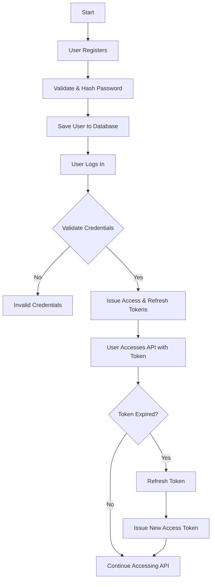

# Authentication Module Documentation

## 1. Problem Statement:
User authentication is a critical part of the Invoice Intelligence system. The authentication module must:
- Allow users to register and log in securely.
- Support authentication via username or email.
- Issue JWT tokens for secure API access.
- Provide user role management.
- Enforce password validation and hashing.

## 2. Overview of the Solution:
To address these requirements, the authentication module consists of:
- A custom `InvoiceUser` model extending Django’s `AbstractUser`.
- User roles (`Admin`, `Balancer`, `Approver`, `Manager`, `Developer`).
- REST API endpoints for registration, login, and token refresh.
- JWT-based authentication using `rest_framework_simplejwt`.

## 3. Architecture of Solution:

**Process:**
1. User registers with username, email, password, and role.
2. Password is validated and hashed.
3. On login, the system validates credentials and issues JWT tokens.
4. Users authenticate using the access token.
5. Tokens can be refreshed using the refresh endpoint.

**Flow Chart:**



## 4. Models:
### `InvoiceUser`
- Extends `AbstractUser`.
- Uses `UUIDField` as primary key.
- Stores `user_role` with predefined choices.

### `BranchActivities`
- Tracks user activities.
- Stores metadata in `JSONField`.

## 5. API Endpoints:

### **User Registration**
- **URL:** `POST /api/auth/register/`
- **Request:**
```json
{
  "username": "john_doe",
  "email": "john@example.com",
  "password": "SecurePass123",
  "user_role": "admin"
}
```
- **Response:**
```json
{
  "id": "uuid",
  "username": "john_doe",
  "email": "john@example.com",
  "user_role": "admin"
}
```

### **User Login**
- **URL:** `POST /api/auth/login/`
- **Request:**
```json
{
  "username": "john_doe",
  "password": "SecurePass123"
}
```
- **Response:**
```json
{
  "access_token": "jwt_token",
  "refresh_token": "jwt_refresh_token",
  "role": "admin"
}
```

### **Token Refresh**
- **URL:** `POST /api/auth/token/refresh/`
- **Request:**
```json
{
  "refresh": "jwt_refresh_token"
}
```
- **Response:**
```json
{
  "access_token": "new_jwt_token"
}
```

## 6. Security Considerations:
- Passwords are hashed using Django’s `set_password`.
- JWT tokens expire and require refresh.
- API endpoints enforce role-based permissions.

## 7. Test Coverage:

### **Positive Scenarios:**
- Valid login with correct credentials.
- Successful registration with required fields.
- Fetching user details correctly.

### **Negative Scenarios:**
- Invalid login credentials.
- Registration with missing fields.
- Trying to create a duplicate user.
- Login with empty username or password.

### **Edge Cases:**
- Password too short.
- Login with non-existent user.
- Fetching user list with pagination and filters.
- Invalid token during token refresh.

### **Gaps:**
- Multi-factor authentication is not tested (requires separate integration tests).

### **Test Case Document:**
For a detailed list of test cases, refer to the [Testcase Document](https://docs.google.com/spreadsheets/d/1M8qw5lngNouTTwRUJeG5nhghC7Q91Wmm0kpHWeDV3SQ/edit?pli=1&gid=0#gid=0).

---
*Version: 1.0  
Date: January 31, 2025*# Authentication Module Documentation

## 1. Problem Statement:
User authentication is a critical part of the Invoice Intelligence system. The authentication module must:
- Allow users to register and log in securely.
- Support authentication via username or email.
- Issue JWT tokens for secure API access.
- Provide user role management.
- Enforce password validation and hashing.

## 2. Overview of the Solution:
To address these requirements, the authentication module consists of:
- A custom `InvoiceUser` model extending Django’s `AbstractUser`.
- User roles (`Admin`, `Balancer`, `Approver`, `Manager`, `Developer`).
- REST API endpoints for registration, login, and token refresh.
- JWT-based authentication using `rest_framework_simplejwt`.

## 3. Architecture of Solution:

**Process:**
1. User registers with username, email, password, and role.
2. Password is validated and hashed.
3. On login, the system validates credentials and issues JWT tokens.
4. Users authenticate using the access token.
5. Tokens can be refreshed using the refresh endpoint.

**Flow Chart:**


## 4. Models:
### `InvoiceUser`
- Extends `AbstractUser`.
- Uses `UUIDField` as primary key.
- Stores `user_role` with predefined choices.

### `BranchActivities`
- Tracks user activities.
- Stores metadata in `JSONField`.

## 5. API Endpoints:

### **User Registration**
- **URL:** `POST /api/auth/register/`
- **Request:**
```json
{
  "username": "john_doe",
  "email": "john@example.com",
  "password": "SecurePass123",
  "user_role": "admin"
}
```
- **Response:**
```json
{
  "id": "uuid",
  "username": "john_doe",
  "email": "john@example.com",
  "user_role": "admin"
}
```

### **User Login**
- **URL:** `POST /api/auth/login/`
- **Request:**
```json
{
  "username": "john_doe",
  "password": "SecurePass123"
}
```
- **Response:**
```json
{
  "access_token": "jwt_token",
  "refresh_token": "jwt_refresh_token",
  "role": "admin"
}
```

### **Token Refresh**
- **URL:** `POST /api/auth/token/refresh/`
- **Request:**
```json
{
  "refresh": "jwt_refresh_token"
}
```
- **Response:**
```json
{
  "access_token": "new_jwt_token"
}
```

## 6. Security Considerations:
- Passwords are hashed using Django’s `set_password`.
- JWT tokens expire and require refresh.
- API endpoints enforce role-based permissions.

## 7. Test Coverage:

### **Positive Scenarios:**
- Valid login with correct credentials.
- Successful registration with required fields.
- Fetching user details correctly.

### **Negative Scenarios:**
- Invalid login credentials.
- Registration with missing fields.
- Trying to create a duplicate user.
- Login with empty username or password.

### **Edge Cases:**
- Password too short.
- Login with non-existent user.
- Fetching user list with pagination and filters.
- Invalid token during token refresh.

### **Gaps:**
- Multi-factor authentication is not tested (requires separate integration tests).

### **Test Case Document:**
For a detailed list of test cases, refer to the [Testcase Document](https://docs.google.com/spreadsheets/d/1M8qw5lngNouTTwRUJeG5nhghC7Q91Wmm0kpHWeDV3SQ/edit?pli=1&gid=0#gid=0).

---
*Version: 1.0  
Date: January 31, 2025*